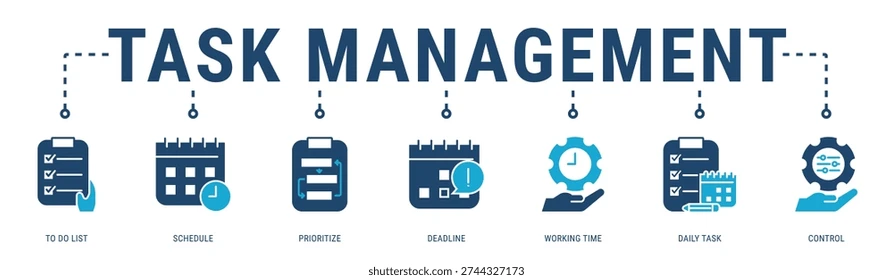
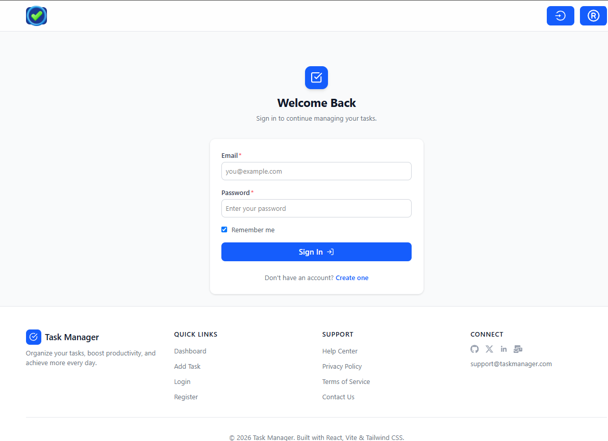
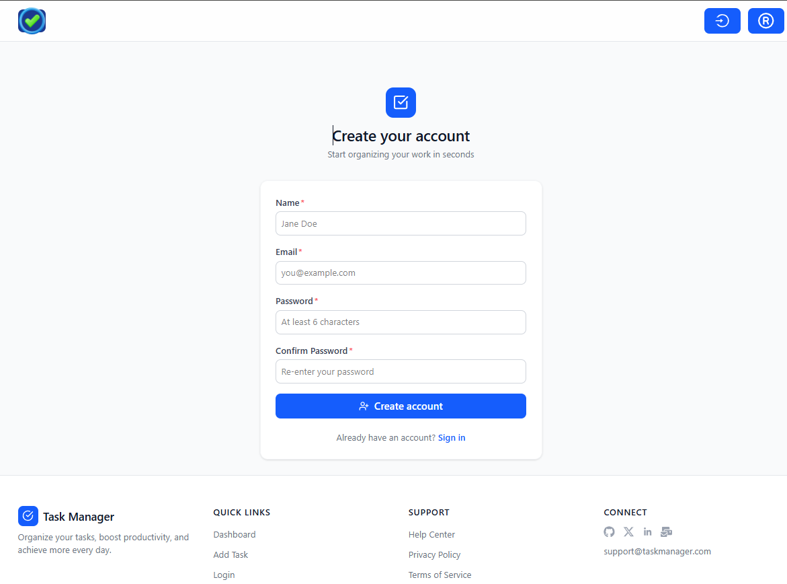
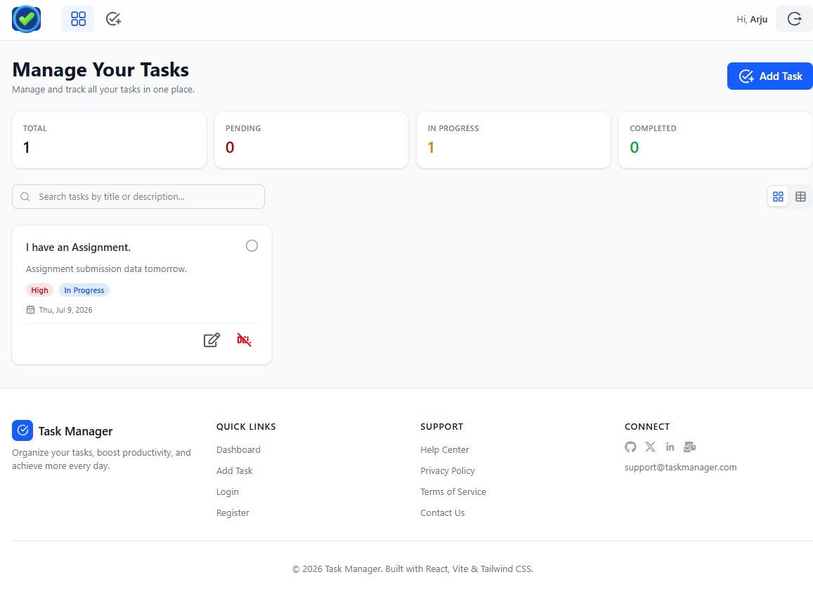
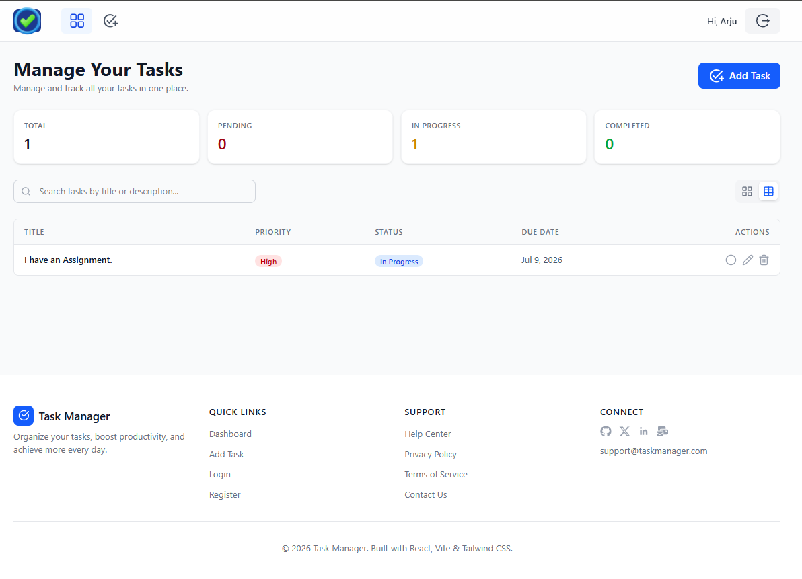
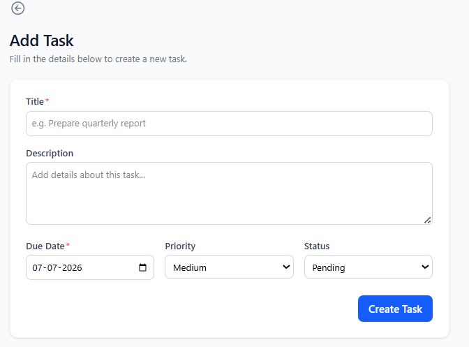
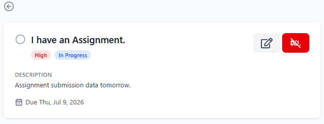
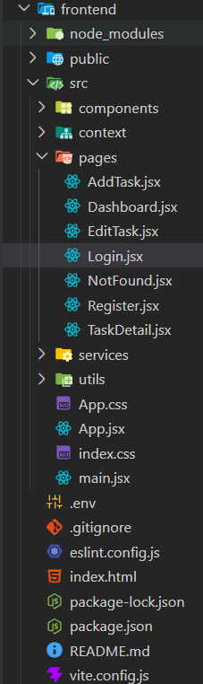
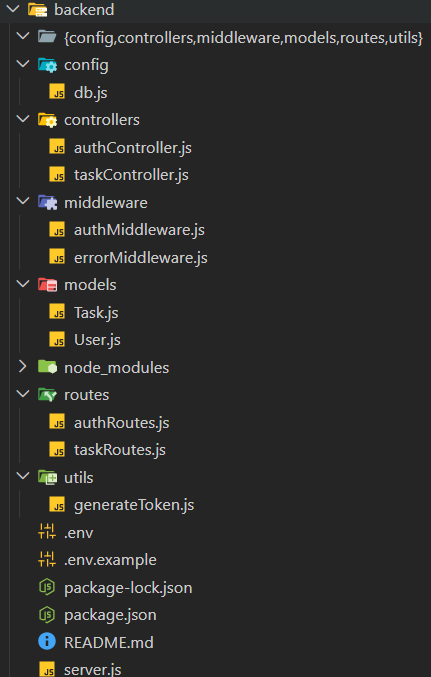

<!-- Banner -->
<p align="center">
  
</p>

<div align="center">

#  Task Manager

### A modern MERN stack task management application

Organise daily tasks with a clean, responsive interface, secure authentication, and a powerful dashboard.

[]([YOUR_FRONTEND_DEPLOYMENT_LINK](https://task-manager-mern-ruddy-eight.vercel.app/))
[](https://documenter.getpostman.com/view/42927869/2sBY4JwNPc)
[](https://portfolio-ruby-gamma-44.vercel.app/)

<br/>

[](https://react.dev/)
[](https://nodejs.org/)
[](https://www.mongodb.com/)
[](https://jwt.io/)
[](https://tailwindcss.com/)


[](LICENSE)

</div>

---

##  Table of Contents

- [About](#-about)
- [Features](#-features)
- [Tech Stack](#-tech-stack)
- [Architecture](#-architecture)
- [Screenshots](#-screenshots)
- [Folder Structure](#-folder-structure)
- [Installation](#-installation--setup)
- [Environment Variables](#-environment-variables)
- [REST API](#-rest-api-reference)
- [API Documentation](#-api-documentation)
- [Deployment](#-deployment)
- [Future Improvements](#-future-improvements)
- [Contributing](#-contributing)
- [License](#-license)
- [Author](#-author)

---

##  About

**Task Manager** is a full-stack **MERN** application (MongoDB, Express, React, Node.js) designed to streamline daily task management. Users can register, log in, and perform full CRUD operations on their personal tasks. The dashboard offers both **Card View** (visual) and **Table View** (structured), along with instant search and pagination.

The project follows industry best practices: MVC architecture on the backend, component-based React structure with reusable UI elements, secure JWT authentication, and a clean separation of concerns. It serves as a production-ready portfolio piece demonstrating modern full-stack development skills.

---

##  Features

** Authentication**

- Register / Login with secure password hashing (bcryptjs)
- JWT-based authentication with protected routes

** Task Management**

- Full CRUD: create, update, delete, view details
- Set priority (High, Medium, Low) and status (To Do, In Progress, Done)
- Due date management

** Dashboard**

- Toggle between Card View and Table View
- Real-time search by task title
- Pagination for large datasets

** User Interface**

- Modern, responsive design (mobile-first)
- Reusable components (cards, modals, forms, loaders)
- Toast notifications for feedback (React Hot Toast)
- Form validation with React Hook Form

**⚙️ Backend**

- RESTful APIs with Express.js
- MVC pattern for maintainability
- Authentication & error handling middleware
- MongoDB with Mongoose ODM

---

##  Tech Stack

**Frontend**  
       

**Backend**  
     

**Tools**  
   

---

##  Architecture
```

React Frontend (Vite) → Axios → REST API (Express) → MongoDB

```

- Frontend sends HTTP requests to the backend API via Axios, attaching the JWT token for protected endpoints.
- Backend validates the request, interacts with MongoDB via Mongoose, and returns JSON.
- State is managed using React Context and custom hooks.


---

##  Screenshots

<details>
<summary>Click to expand</summary>

| Login | Register |
|-------|----------|
|  |  |

| Card View | Table View |
|-----------|------------|
|  |  |

| Create Task | Task Details |
|-------------|--------------|
|  |  |

| Frontend Structure | Backend Structure |
|--------------------|--------------------|
|  |  |

</details>

---

##  Folder Structure

```

Task-Manager/
├── frontend/
│ ├── public/
│ ├── src/
│ │ ├── assets/
│ │ ├── components/ # Reusable UI components
│ │ ├── context/ # React contexts (Auth)
│ │ |
│ │ |
│ │ ├── pages/ # Route pages
│ │ |
│ │ ├── services/ # Axios instances & API calls
│ │ ├── utils/ # Helpers & constants
│ │ ├── App.jsx
│ │ └── main.jsx
│ ├── .env
│ └── package.json
│
├── backend/
│ ├── config/ # DB connection, environment config
│ ├── controllers/ # Request handlers
│ ├── middleware/ # Auth, error handling
│ ├── models/ # Mongoose schemas
│ ├── routes/ # Express routes
│ ├── utils/ # Token generation, helpers
│ ├── app.js
│ ├── server.js
│ ├── .env
│ └── package.json
│
├── screenshots/
├── README.md
└── LICENSE

````

---

## ⚙️ Installation & Setup

### Prerequisites
- **Node.js** (v18+)
- **npm** or **yarn**
- **MongoDB** (local or Atlas)
- **Git**

### 1. Clone the repository
```bash
git clone https://github.com/YOUR_USERNAME/Task-Manager.git
cd Task-Manager
````

### 2. Backend setup

```bash
cd backend
npm install
```

Create a `.env` file (see [Environment Variables](#-environment-variables)) and then:

```bash
npm run dev    # starts on http://localhost:5000
```

### 3. Frontend setup

```bash
cd ../frontend
npm install
```

Create a `.env` file with `VITE_API_URL=http://localhost:5000/api` and then:

```bash
npm run dev    # starts on http://localhost:5173
```

---

##  Environment Variables

### Backend (`backend/.env`)

| Variable     | Description               | Example                 |
| ------------ | ------------------------- | ----------------------- |
| `PORT`       | Server port               | `5000`                  |
| `MONGO_URI`  | MongoDB connection string | `mongodb+srv://...`     |
| `JWT_SECRET` | Secret key for JWT tokens | `a1b2c3d4e5f6...`       |
| `CLIENT_URL` | Allowed CORS origin       | `http://localhost:5173` |

### Frontend (`frontend/.env`)

| Variable       | Description      | Example                     |
| -------------- | ---------------- | --------------------------- |
| `VITE_API_URL` | Backend base URL | `http://localhost:5000/api` |

---

## 📡 REST API Reference

### Authentication

| Method | Endpoint             | Auth Required | Description       |
| ------ | -------------------- | ------------- | ----------------- |
| POST   | `/api/auth/register` | No            | Register new user |
| POST   | `/api/auth/login`    | No            | Login & get token |
| GET    | `/api/auth/profile`  | Yes           | Get user profile  |

### Tasks

| Method | Endpoint         | Auth Required | Description                       |
| ------ | ---------------- | ------------- | --------------------------------- |
| GET    | `/api/tasks`     | Yes           | Get tasks (paginated, searchable) |
| GET    | `/api/tasks/:id` | Yes           | Get single task                   |
| POST   | `/api/tasks`     | Yes           | Create new task                   |
| PUT    | `/api/tasks/:id` | Yes           | Update task                       |
| DELETE | `/api/tasks/:id` | Yes           | Delete task                       |

**Query parameters for GET /tasks:** `page`, `limit`, `search`

---

##  API Documentation

Complete API documentation with request/response examples is available on Postman:  
[](https://documenter.getpostman.com/view/42927869/2sBY4JwNPc)

---

##  Deployment

| Service  | URL (placeholder)           |
| -------- | --------------------------- |
| Frontend | `https://task-manager-mern-ruddy-eight.vercel.app/` |
| Backend  | `https://task-manager-mern-6mdr.onrender.com/api`  |

**Recommended platforms:** Vercel (frontend), Render (backend), MongoDB Atlas (database).

---

##  Future Improvements

- [ ] Dark mode & theme customisation
- [ ] Drag and drop task reordering
- [ ] Email verification & password reset
- [ ] Notifications (browser/email)
- [ ] Calendar view
- [ ] AI-based task suggestions
- [ ] Team collaboration & shared tasks

---

##  Contributing

Contributions are welcome!

1. Fork the project
2. Create a feature branch (`git checkout -b feature/AmazingFeature`)
3. Commit your changes
4. Push and open a Pull Request

---

##  License

Distributed under the MIT License. See `LICENSE` for details.

---

##  Author

**Madhur Chaturvedi** – Full Stack MERN Developer

[](https://github.com/madhur2004)
[](https://www.linkedin.com/in/madhur-chaturvedi-49136a256/)
[](https://portfolio-ruby-gamma-44.vercel.app/)

---

<div align="center">

**⭐ If you like this project, a star would mean a lot!**  
Made with ❤️ by Madhur Chaturvedi

</div>
